## 问题与范围

问题：当前项目里，页面发送一个桥接请求后，调试工具是怎么知道应该回哪个桥接事件的？以 `openCamera` 为例，它到底监控了什么、按什么规则回调。

范围：只看当前仓库里的桥接拦截、请求记录、规则匹配、页面回放，不推测业务侧未在仓库中的协议实现。

## 速答

当前工具不是“发出请求后维护一张待响应请求表，再按 requestId/callbackId 找回去”，而是“拦截 `AndroidBridge.postMessage` 的入参，解析出其中的 `event` 字段，再按事件名匹配规则并回放一个 DOM `CustomEvent`”。

`openCamera` 之所以能被“监控”，不是因为代码里写死监听了 `openCamera`，而是因为所有桥接发送都会先经过被注入的 `window.AndroidBridge.postMessage`。工具把消息解析后拿到 `event === "openCamera"`，再去找 `match.event === "openCamera"` 的规则；命中后，再把规则里配置的 `response.eventName` 回发给页面。当前预置规则里 `openCamera` 的匹配事件和回发事件恰好都叫 `openCamera`，所以看起来像“发 `openCamera`，回 `openCamera`”。

```mermaid
graph LR
  A["页面调用 AndroidBridge.postMessage(...)"] --> B["injectMain 拦截并解析消息"]
  B --> C["window.postMessage({ type: 'BRIDGE_CALL' })"]
  C --> D["content/controller 读取 parsedMessage.event"]
  D --> E["findMatchingRule(rule.match.event === eventName)"]
  E --> F["dispatchToPage(response.eventName, response.detail)"]
  F --> G["injectMain 转成 window.dispatchEvent(CustomEvent)"]
  G --> H["页面监听对应事件名并收到 detail"]
```

## 关键证据

1. 注入脚本直接替换了 `window.AndroidBridge`，所有 `postMessage` 都会先进入 `createMockBridge().postMessage()`，并被转成页面内的 `window.postMessage({ type: "BRIDGE_CALL" ... })`。这说明工具监控的是统一桥接出口，不是单独监听 `openCamera`。证据：`src/injected/injectMain.ts:33-47`、`src/injected/injectMain.ts:58-65`
2. 内容脚本收到 `BRIDGE_CALL` 后，会从 `parsedMessage` 里读取 `event` 字段作为桥接名；如果没有 `event`，直接记错误，不会继续匹配。证据：`src/content/controller.ts:78-91`、`src/content/controller.ts:94-110`、`src/content/runtime.ts:153-160`
3. 规则匹配只看事件名精确相等：`rule.enabled && rule.match.event === eventName`。没有 requestId、callbackId 或其他关联键参与匹配。证据：`src/shared/rules.ts:7-12`、`src/shared/ruleTypes.ts:8-16`
4. 命中规则后，内容脚本不会“回复某个请求对象”，而是调用 `dispatchToPage(eventName, detail)` 向页面发一个 `DISPATCH_EVENT` 消息；该消息类型本身也只带 `eventName` 和 `detail`。证据：`src/content/controller.ts:115-125`、`src/content/controller.ts:288-303`、`src/content/runtime.ts:141-150`、`src/shared/messageTypes.ts:43-50`
5. 注入脚本把 `DISPATCH_EVENT` 再转成 `window.dispatchEvent(new CustomEvent(message.payload.eventName, { detail }))`。也就是说，最终页面收到的是“某个事件名的 DOM 自定义事件”。证据：`src/injected/injectMain.ts:67-77`
6. `openCamera` 预置规则明确写的是 `match.event: "openCamera"`，响应也配置成 `response.eventName: "openCamera"`。因此 `openCamera` 只是规则数据中的一条配置，不是写死在拦截逻辑里的特殊分支。证据：`src/shared/presets.ts:34-59`

## 细节展开

### 1. 这个工具如何“监控”桥接

关键不在 `openCamera`，而在 `AndroidBridge.postMessage`。

注入脚本启动时会执行 `installAndroidBridgeMock()`，默认把 `window.AndroidBridge` 切到 `createMockBridge()`。页面后续所有桥接请求只要走这个入口，就会先被工具看到。工具看到的原始信息包括：

- `rawMessage`
- `parsedMessage`

如果 `message` 是字符串，注入脚本会先 `JSON.parse()`。后面的匹配逻辑只关心解析结果中的 `event` 字段。

### 2. 当前“请求 -> 响应”关联依据是什么

当前实现只有一层关联：**事件名**。

也就是：

- 页面发：`{ event: "openCamera", ... }`
- 工具读到：`eventName = "openCamera"`
- 规则命中：`rule.match.event === "openCamera"`
- 工具回发：`rule.response.eventName`

因此它并不知道“这是第几个 `openCamera` 请求”，也不知道“某个响应应该归属给哪个 callbackId”。它只知道“刚刚发出的是 `openCamera` 这个桥接名”。

### 3. 为什么看起来像“自动回对了”

因为当前规则模型把“匹配事件”和“回发事件”都做成了显式字段：

- `match.event`
- `response.eventName`

在预置数据里，很多规则都把两者配成同名，例如 `openCamera -> openCamera`、`toLogin -> toLogin`。所以从效果上看像“工具自动知道该回应哪个桥接”，但本质上是规则数据提前定义好的。

### 4. 什么情况会匹配不上

以下情况当前实现都会失败或偏离预期：

- 发送消息里没有 `event` 字段
- 业务协议依赖 `requestId` / `callbackId` 做一对一回调
- 同名桥接并发发起，但需要按请求实例而不是按事件名区分响应
- 页面没有监听工具最终回放的那个 DOM 事件名

### 5. 面板里能不能区分发送和响应

能区分。日志类型本身就分成 `SEND`、`MOCK`、`EMIT`、`WARN`、`ERROR`，而且面板上有对应的类型筛选和颜色标识；日志行里也会分别展示“请求”和“响应”详情。对于单向桥接，通常只会有 `SEND`，不会有 `MOCK`。

## 未决问题

仓库里没有业务页面侧代码，无法确认真实页面是直接监听 `window` 自定义事件，还是在更上层又封装了一层桥接 SDK。因此这里只能确认工具“回放了哪个事件名”，不能确认业务侧“如何消费这个事件”。

## 后续建议

如果业务桥接协议需要按请求实例精确关联响应，当前工具模型不够，需要单独引入 `requestId/callbackId` 采集、存储和分发机制。

## 相关文档

无。
